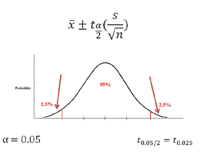

# Python essentials
A confidence interval is a range of values defined such that there is a specified probability that the value of a parameter lies within the interval.The expression for computing a confidence interval for the (population) mean is:  
 

In order to calculate the confidence interval bounds, we need to determine the appropriate value for the t-multiple. In the SciPy (scipy) module, there is a function stats.t that contains various methods for working with the t-distribution. In particular, there is a .ppf method that is used to determine specific quantiles of the distribution for a given sample size (n, or degrees of freedom, n - 1). The function takes in a quantile (q) and a degrees of freedom (df), and (by default), returns the value for which F(x) = q, where F is the cumulative distribution function (cdf). For this exercise, assume a assume a sample size n = 30.

    1. Calculate the t value using scipy.stats.t.ppf
    2. Calculate the 95% confidence interval for the (population) mean
    3. Calculate the sample standard deviation.
    4. Calculate 95% confidence interval limits
    
Another part of the project discusses methods to correct the typological errors in strings

