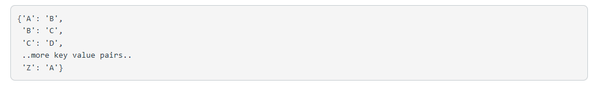
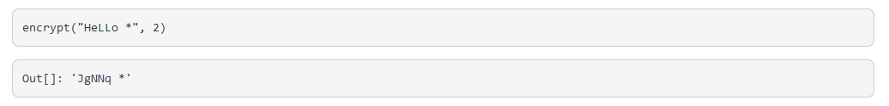
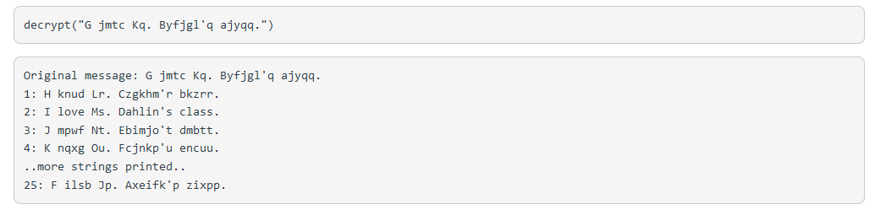

# Caesar cipher
One of the earliest forms of cryptography was the Caesar cipher, a form of substitution cipher in which each letter in the alphabet is shifted by a fixed number of positions (with wrapping). Caesar himself used a left shift of three (-3), but any shift can be used. For example, a Caesar cipher with a right shift of two (+2) would replace the letter 'A' with the letter 'C', the letter 'B' with the letter 'D', and so on, with the letters 'Y' and 'Z' being replaced with the letters 'A' and 'B', respectively. In such a scheme, the word 'ANALYTICS' would be encrypted as 'CPCNAVKEU'  

Project steps: 

        Step 1: Define a function shift_alpha that takes in an alphabet string (A) and a shift constant (shift, default value of 0), 
        prints the original and shifted alphabet (each   as a single string), and returns a dictionary that contains each original 
        letter as the key and the encrypted letter as the value. For example, a shift of 1, would have the output:
 
        
        Step 2: Define a function encrypt that takes in a word and a shift (default value = 0), and returns a string containing the 
        encrypted version of the word using a Caesar shift. The function should work properly on upper and lower case letters, and 
        return any non-alphabetic characters as is. For example, an input of "HeLLo *" and a shift of 2  will look like:
 
    
        Step 3: Using the encrypt function from Step 2, write a function decrypt that takes in a message, and produces all possible 
        translations of the message using a Caesar cipher. Report the decrypted message and the shift (in the range of [-12, 13]). 
        Your output should be 26 shifted messages (including a shift of 0). For example: 
 
    
    
